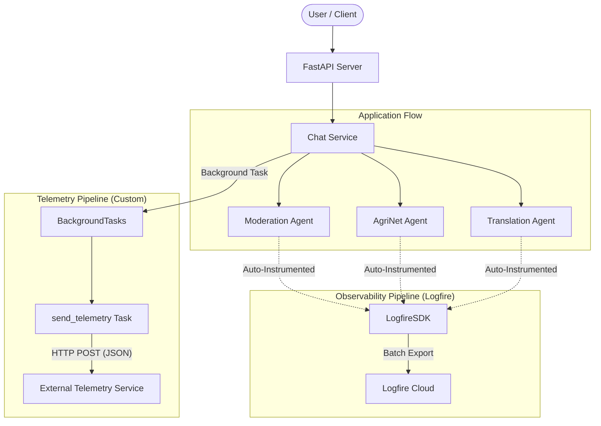

# Telemetry Architecture & Data Flow

## High-Level Architecture

The telemetry system operates on two parallel tracks:

1.  **Business Logic Telemetry (Async/Background)**: Captures high-level business events (e.g., "Farmer asked a question", "Content was moderated"). This is handled asynchronously to avoid blocking the user experience.
2.  **System Observability (Real-time/Integrated)**: Captures low-level execution details of the AI agents using Logfire.

## Detailed Data Flows

### 1. Request & Business Event Flow
When a user sends a message to the `/chat` endpoint:

1.  **Request Receipt**: The API receives the request.
2.  **Processing**: `app.services.chat.stream_chat_messages` is invoked.
3.  **Event Creation**:
    *   As the request is processed, specific events (like `OE_MODERATION`) are instantiated using models from `helpers/telemetry.py`.
    *   *Example*: After moderation checks, a `ModerationEventEks` object is created with success/failure flags.
4.  **Buffering**: The events are wrapped in a `TelemetryRequest` object.
5.  **Dispatch**: The `send_telemetry` task is added to FastAPI's `BackgroundTasks`. This ensures the HTTP response to the user is not delayed by the telemetry network call.
6.  **Transmission**: After the response is sent to the user, FastAPI executes the background task, which POSTs the data to `TELEMETRY_API_URL`.

### 2. AI Agent Observability Flow
This flow runs automatically for agents instrumented with Pydantic AI and Logfire.

1.  **Initialization**: `logfire.configure()` is called at application startup (in `agents/__init__.py`).
2.  **Execution**: When an agent (e.g., `translation_agent`) runs, Logfire intercepts the call.
3.  **Tracing**: It captures:
    *   Input prompts
    *   LLM Tool calls and arguments
    *   Model outputs and latency
    *   Token usage
4.  **Export**: Data is sent asynchronously to the Logfire platform using the `logfire_token` configured in `app/config.py`.

## Connection Across Modules

*   **`app/main.py`**: Entry point. Does not have global telemetry middleware, but initializes the app context.
*   **`app/services/`**: The "Business Logic" layer where events are explicitly created.
*   **`helpers/telemetry.py`**: The "Schema" layer ensuring all events match the external system's expectations (EkStep).
*   **`app/tasks/`**: The "Transport" layer responsible for the actual network IO.

## Network Dependencies

*   **Outbound HTTP (Custom)**: Uses standard `requests` library. Requires outbound access to the configured `TELEMETRY_API_URL`.
*   **Outbound HTTPS (Logfire)**: Requires outbound access to Logfire API endpoints.
